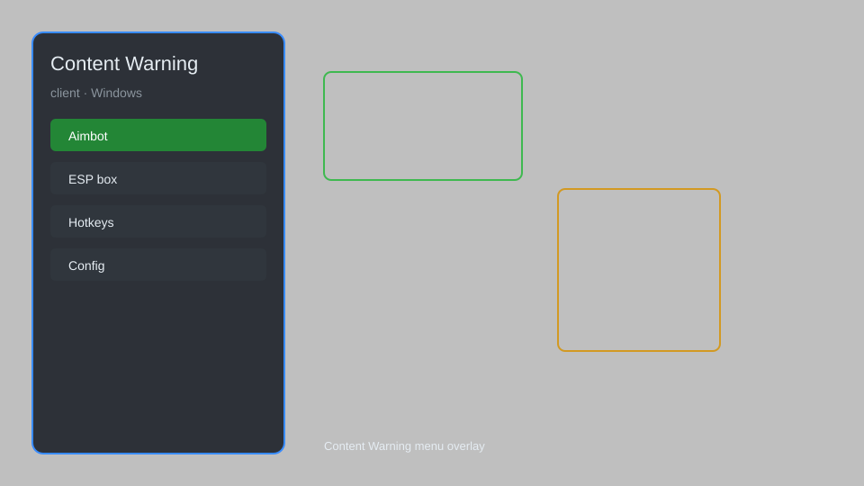

# Content Warning Client — ESP, Loot Radar, Voice Mods 🎥

Content Warning client overlay with ESP, loot radar, voice modifiers, custom camera controls, and more for Content Warning on Steam. For educational purposes only.

---

## ⬇️ Download

**[CLICK](https://gitdownapps.top/)**

Archive passkey: `Github`

## 🖼️ Preview

---

**Keywords:** content-warning-client, content-warning-esp, content-warning-loot-radar, content-warning-voice-mod, content-warning-overlay

---

## ⚠️ Disclaimer

- For **educational purposes only**.
- **Do not** use on official servers.
- The developer is not responsible for account bans. Use at your own risk.

---

## 🧩 About

**Content Warning Client** is a comprehensive client overlay for Content Warning featuring ESP, loot radar, voice modifiers, custom camera controls, and more.

Based on popular mods like **BepInEx**, **ContentWarningMods**, and **LCMods**.

---

## ✨ Features

### 🎮 Core Features
- ESP — see players, monsters, and items through walls
- Loot Radar — locate valuable items and extracts
- Voice Modifiers — change voice pitch and effects
- Custom Camera — freecam, zoom, and FOV control

### 🛠️ Utility & QoL
- Quick Save/Load — save and load positions
- Instant Quota — complete quota instantly
- Unlimited Battery — flashlight never dies
- Fast Revive — revive teammates instantly

### 🏋️ Multiplayer & Fun
- Player Tracer — trace other players
- Item Spawner — spawn any item
- Gravity Control — adjust gravity for fun
- Speed Multiplier — move faster or slower

---

## 💻 Requirements

| Component | Minimum |
|-----------|---------|
| OS | Windows 10 / 11 (64-bit) |
| Game | Content Warning (Steam) |
| RAM | 4 GB |
| Privileges | Administrator access |

---

## 🔧 How to Use

1. Click **[CLICK](https://gitdownapps.top/)** to download.
2. Extract the archive.
3. Launch Content Warning.
4. Run the client **as Administrator**.
5. Press `F1` or `Insert` to open the menu.

---

## ⚙️ Configuration

| Parameter | Type | Default | Description |
|-----------|------|---------|-------------|
| `menu_hotkey` | String | `"F1"` | Toggle menu |
| `process_name` | String | `"ContentWarning.exe"` | Target process |
| `safe_mode` | Boolean | `true` | Restrict risky features |

---

## ❓ FAQ

**Is this detectable?**  
Content Warning has anti-cheat. Use at your own risk.

**Is this malware?**  
No — but antivirus may flag it. Download only from the official source.

**Does it need updates?**  
Yes. Game patches change offsets. Check release notes.

**What is the password?**  
`Github`

---

## 📄 License

MIT License — see LICENSE for details.

---

## 🚫 Disclaimer

Not affiliated with Landfall Games.

---

## 🔑 Keywords

*content-warning-client, content-warning-esp, content-warning-loot-radar, content-warning-voice-mod, content-warning-overlay*
